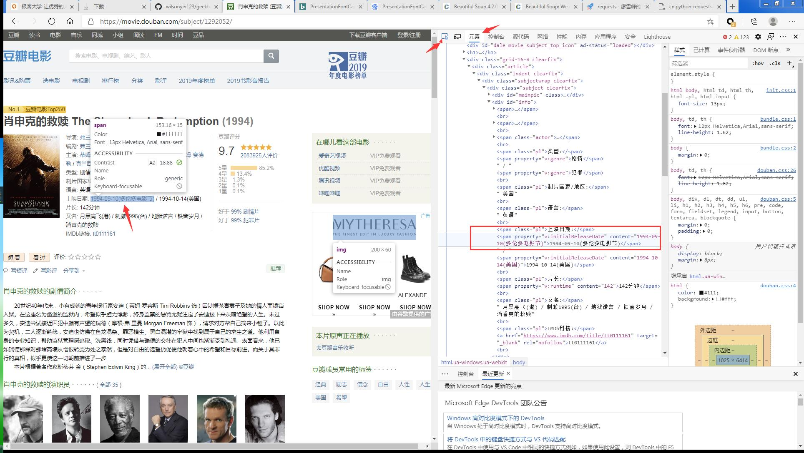
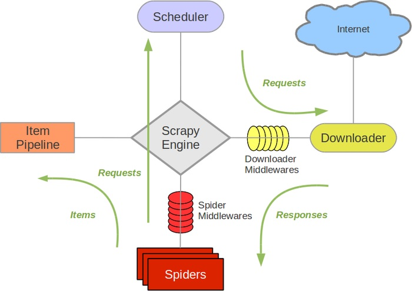

学习笔记
# python爬虫

## requests
### requests 文档
``` import requests ```
[Requests: 让 HTTP 服务人类](https://cn.python-requests.org/zh_CN/latest/)


requests 设置header
```
def requests_test1():
    user_agent = "Mozilla/5.0 (Windows NT 6.1; Win64; x64) AppleWebKit/537.36 (KHTML, like Gecko) Chrome/83.0.4103.116 Safari/537.36 Edg/83.0.478.64"

    h = {'user-agent': user_agent}

    target_url = "https://movie.douban.com/top250"
    
    response = requests.get(target_url, headers=h)

    print (response.text)
    print (response.status_code)
```
不设置headers, 此请求返回418

### requests与urllib对比

``` from urllib import request ```
urllib是一个库，包含很多包，也可以使用
```
import urllib.request
```
urllib使用起来不如requests方便。

```
# urllib 例子

```

## BeautifulSoup

```
from bs4 import BeautifulSoup as bs
```

[Beautiful Soup 4.2.0 文档](https://www.crummy.com/software/BeautifulSoup/bs4/doc/index.zh.html)

参数：
```
def __init__(self, markup="", features=None, builder=None,
                 parse_only=None, from_encoding=None, exclude_encodings=None,
                 element_classes=None, **kwargs):
```
主要的解析器有4种。

+ 创建BeautifulSoup对象，将响应文本传参，指定解析器。之后BeautifulSoup对html进行了解析
+ 使用find_all或find方法来查找需要的内容。传如元素名，执行属性等（字典形式）
+ 获取属性使用get('属性名')， 获取文本使用text

## XPath使用
### 浏览器操作
进入[豆瓣-肖生克的救赎](https://movie.douban.com/subject/1292052/)
打开浏览器调试界面，选择“元素”标签。
然后点击我们要关注的信息，比如“上映日期”1994-09-10。此时右侧出现对应的html代码。

如果我们使用BeautifulSoup查找，要找到span标签，content。
我们在代码侧，鼠标右键---复制---复制Xpath。
使用Xpath也可以匹配到span标签。 win+f打开搜索栏，输入拷贝的XPath，此时对应的标签会高亮显示。

### 在python中使用XPath
首先要导入lxml.etree
使用lxml.etree.HTML()来处理html页面内容。
使用 lxml.etree.HTML().xpath()来选择对应的内容。
```
import lxml.etree
def xpath_test():
    text = requests_test("https://movie.douban.com/subject/1292052/")
    selector = lxml.etree.HTML(text)

    film_name = selector.xpath('//*[@id="content"]/h1/span[1]/text()')
    print("film name is %s" % (film_name))
    
    actor = selector.xpath('//*[@id="info"]/span[3]/text()')
    print("actors: %s" % actor)
    
    summary = selector.xpath('//*[@id="link-report"]/span[1]/span/text()')
    print ("summary: %s" % summary)
```
xpath传参时，从浏览器中复制出的xpath+text()方法。意思是取标签的内容。

### 使用pandas保存数据
导入pandas库
使用DataFrame方法
使用to_csv()方法保存成csv文件
```
import pandas as pd
def pandas_test():
    d = xpath_test()
    movie_info = pd.DataFrame(data=d)
    movie_info.to_csv("./movie.csv", encoding='gbk',
                      index=False, header=False)
```
### 翻页功能

```
def page_turn():
    urls = tuple(f"https://movie.douban.com/top250?start={ page * 25 }&filter=" for page in range(0, 10))
    print (urls)

    for url in urls:
        print (url)
        text = requests_test(url)
        selector = lxml.etree.HTML(text)
        name = selector.xpath(
            '//*[@id="content"]/div/div[1]/ol/li[2]/div/div[2]/div[1]/a/span[1]/text()')
        print (name)
```

## Python 基础语法
[Python 数据结构](https://docs.python.org/zh-cn/3/tutorial/datastructures.html)<br/>
[Pyhton 其他流程控制工具](https://docs.python.org/zh-cn/3/tutorial/controlflow.html)<br/>
[Pyhton 中的类](https://docs.python.org/zh-cn/3/tutorial/classes.html)<br/>
[Python 定义函数](https://docs.python.org/zh-cn/3/tutorial/controlflow.html#defining-functions)

## 前端基础知识
W3C标准

结构，表现，行为
html, css, js


## scrapy
### scrapy特点
集成了很多功能，

### 核心组件
* 引擎：数据的下载、处理，都会流经引擎。高效处理爬取的数据。
* 调度器：对请求排序，结果去重，
* 下载器：相比requests更加强大的下载工具
* 爬虫：从特定的网页中提取需要的信息。类似BeautifulSoup等
* 项目管道：通过管道将数据存入指定的介质中。

### scrapy工作流程


引擎是爬虫最开始运行的部分。引擎首先通过自己的配置，找到要去什么域名去爬取数据。引擎根据域名，去找到对应的爬虫组件，一个Scrapy可以配置多个Spider组件。<br/>
spider组件对要爬取的url发起请求，请求会进入调度器。根据传入的请求的先后顺序放到调度器中。此时，会先做一次去重。然后调度器根据请求顺序再发给引擎，引擎再去找到Downloader，发起真正的请求。返回的信息会再次传入给引擎。
再请求发给下载器和下载器将结果返回给引擎时，都会经过Downloader Middlewares。下载中间件就可以在发起下载和下载结束后做一个中间处理，比如过滤，增加删减内容等。<br/>
当返回结果达到引擎后，引擎会将结果返回给Spider，此时可以通过Spider Middlewares做进一步处理。
Spider对结果的处理，有两个方向，一个时Item Pipeline, 一个是Scheduler。如果爬取结束，就通过Item Pipeline交给Item 进行数据保存。如果要对返回结果再次进行爬取，就将结果再次发给引擎，在给调度器。。。

一般使用scrapy,只需要修改爬虫器和管道即可。

### Scrapy使用
* scrapy安装： pip install scrapy
* 创建scrapy工程： scrapy startproject spiders  # 创建一个名为spiders的工程
* 进入工程路径： cd  spiders/spiders
  文档提示 cd spiders其实是进入spiders/spiders
* 使用genspider来产生一个新的spider: $scrapy genspider example example.com, 此时要为这个spider命名，并且要对应一个域名，也就是要爬取的域名。scrapy会自动生成和改域名相关的设置，不建议随便填写域名。 <br/>
  比如  scrapy genspider movies douban.com, 此时创建了一个名为movies的爬虫，它是基于basic模板创建的。可以通过import spiders.spiders.movies 来使用这个爬虫模块。
  在执行genspider之前，spiders/spiders/spiders下面只有初始化文件__init__.py，没有真正的spider初始化文件。
  执行完genspider之后，在spiders\spiders\spiders下就生成了movies.py的文件， 这就是生成的爬虫。

此时的目录结构
```
spider1
├── scrapy.cfg
└── spider1
    ├── __init__.py
    ├── items.py
    ├── middlewares.py
    ├── pipelines.py
    ├── __pycache__
    │   ├── __init__.cpython-37.pyc
    │   └── settings.cpython-37.pyc
    ├── settings.py
    └── spiders
        ├── __init__.py
        ├── movies.py
        └── __pycache__
            └── __init__.cpython-37.pyc
```
这些文件和scrapy架构中模块的对应关系：
|Python文件 |    说明    |
|-----------|-----------|
|settings.py|项目设置文件|
|scrapy.cfg |项目配置文件|
|items.py   |定义所爬取记录的数据结构|
|movies.py  |编写爬虫逻辑|
|pipelines.py|设置保持位置|

#### scrapy.cfg
```
# Automatically created by: scrapy startproject
#
# For more information about the [deploy] section see:
# https://scrapyd.readthedocs.io/en/latest/deploy.html

[settings]
default = spider1.settings

[deploy]
#url = http://localhost:6800/
project = spider1
```
"settings" 它的整个设置文件被写入到spiders1目录下的settings.py文件中。

#### settings.py
一般情况下可能不需要修改配置。 当出现异常，或需要优化的时候，就需要修改。
在settings.py中，可以修改USER_AGENT等等。。。

#### movies.py (爬虫文件)
```
import scrapy


class MoviesSpider(scrapy.Spider):
    name = 'movies'
    allowed_domains = ['douban.com']
    start_urls = ['http://douban.com/']

    def parse(self, response):
        pass
```
+ import scrapy 不但引入了scrapy库自身的一系列功能，还引入了item.py, pipelines.py等这些我们自己定义的这些信息。
+ 建议类首字母大写，方法首字母小写（PEP8）
+ name = 'movies',   在运行爬虫时，传入的爬虫名字一定要是'movies'，$scrapy crawl movies
+ allowed_domains， 爬取范围
+ start_urls，爬取入口。 scrapy使用了Twisted异步框架，需要一个启动请求。scrapy 根据start_urls来设置一些http头。
+ parse方法的参数response是 start_urls通过调度器和下载器发起了一次请求之后得到的响应信息


### 代码实现

#### 最简单的实现
修改入口url, 编写parse, 在settings.py中设置（爬豆瓣时必须设置， 打开USER_AGENT即可）
```
class MoviesSpider(scrapy.Spider):
    name = 'movies'
    allowed_domains = ['douban.com']
    start_urls = ['https://movie.douban.com/top250']

    def parse(self, response):
        print ("Hello spider!")
        # print(response.text)
        print (dir(response))
```
执行 `scrapy crawl movies` 即可。
可以看到response的属性和方法：
```
['_DEFAULT_ENCODING', '__class__', '__delattr__', '__dict__', '__dir__', '__doc__', '__eq__', '__format__', '__ge__', '__getattribute__', '__gt__', '__hash__', '__init__', '__init_subclass__', '__le__', '__lt__', '__module__', '__ne__', '__new__', '__reduce__', '__reduce_ex__', '__repr__', '__setattr__', '__sizeof__', '__slots__', '__str__', '__subclasshook__', '__weakref__', '_auto_detect_fun', '_body', '_body_declared_encoding', '_body_inferred_encoding', '_cached_benc', '_cached_decoded_json', '_cached_selector', '_cached_ubody', '_declared_encoding', '_encoding', '_get_body', '_get_url', '_headers_encoding', '_set_body', '_set_url', '_url', 'body', 'body_as_unicode', 'cb_kwargs', 'certificate', 'copy', 'css', 'encoding', 'flags', 'follow', 'follow_all', 'headers', 'ip_address', 'json', 'meta', 'replace', 'request', 'selector', 'status', 'text', 'url', 'urljoin', 'xpath']
```

爬虫默认的行为是请求start_urls， 然后有parse处理响应信息。

#### 翻页爬取电影列表
爬虫的默认行为不符合要求。需要在parse前完成翻页功能。在scrapy中有start_requests方法，引擎会自动调用该方法，并且只会被调用一次。start_requests的默认实现是读取start_urls，生成Request对象，发送给引擎，引擎再指挥其他组件向网站服务器发起请求。所以这里需要重载start_requests方法。
```
def start_requests(self):
    for page in range(10):
        url = 'https://movie.douban.com/top250?start=%d&filter=' % (
            page * 25)
        yield scrapy.Request(url=url, callback=self.parse)
```
Request可以设置响应解析方法。默认是parse。
这里使用BeautifulSoup来解析网页。
```
def parse(self, response):
    soup = BeautifulSoup(response.text, 'html.parser')
    title_list = soup.find_all('div', attrs={'class': 'hd'})
    for title_elem in title_list:
        title = title_elem.find('a').find('span').text
        link = title_elem.find('a').get('href')
        print ("============")
        print (title)
        print (link)
        print ("------------")
    print ("++++++++++++++")
```

#### 存储爬取结果
我们可以在parse方法中实现存储过程，但并不是一个好的方法。为了让存储更加灵活，加入了item组件。通过管道，将结果传递给不同的items，从而存储到不同的介质中。 当我们需要修改存储介质时，就不需要修改parse的实现，这样利用管道就达到了解耦的作用（消息队列也举手了）。
- 在movies.py中引入DoubanmovieItem
  `from spiders.items import SpidersItem`
- 在spiders/spiders/spiders/items.py中修改SpidersItem类
  比如现在要存储title和link, 就要在SpidersItem中写上响应的item。它们的属性是一个固定值，scrapy.Field()
  ```
    class SpidersItem(scrapy.Item):
        # define the fields for your item here like:
        # name = scrapy.Field()
        title = scrapy.Field()
        link = scrapy.Field()
  ```

- 在parse方法中，将title和link保存在item对象中，并返回给pipelines
```
def parse(self, response):
    items = []
    soup = BeautifulSoup(response.text, 'html.parser')
    title_list = soup.find_all('div', attrs={'class': 'hd'})
    for title_elem in title_list:
        item = SpidersItem()
        title = title_elem.find('a').find('span').text
        link = title_elem.find('a').get('href')
        item['title'] = title
        item['link'] = link
        items.append(item)
        
    return items
```

- pipeline.py中的SpidersPipeline::process_item方法会处理每一个item
```
class SpidersPipeline:
    def process_item(self, item, spider):
        #print ("@process_item, title=%s" % item["title"])
        return item
```
  默认行为是直接返回item, 在终端上直接打印item。可以在这里实现item的存储。
  在此之前，<font color=#ff0000 size=3 face="黑体">需要在settings.py中的ITEM_PIPELINES中激活组件 </font>
```
ITEM_PIPELINES = {
    'spiders.pipelines.SpidersPipeline': 300,
}
```


### 其他设置
user-agent设置
DOWNLOAD_DELAY = 1 下载时延

### 电影详情页爬取
scrapy 的spiders得到结果后可以有两条路选择，一个是到达items, 另一个是再次向scheduler发起请求。现在通过top250页面得到了电影的链接，再次对电影链接发起请求就可以得到电影详情。所以要对之前的parse方法进行修改。<br/>
要继续对链接发起请求，就要在parse中返回Request对象。
```
def parse(self, response):
    items = []
    soup = BeautifulSoup(response.text, 'html.parser')
    title_list = soup.find_all('div', attrs={'class': 'hd'})
    for title_elem in title_list:
        item = SpidersItem()
        title = title_elem.find('a').find('span').text
        link = title_elem.find('a').get('href')
        item['title'] = title
        item['link'] = link
        # items.append(item)
        yield scrapy.Request(url=link, meta={'item': item}, callback=self.parse2)
```
Request对象的url是link, 此外要传入item 给meta,  编写详情页的解析函数self.parse2
```
def parse2(self, response):
        item = response.meta['item']
        soup = BeautifulSoup(response.text, 'html.parser')
        content = soup.find(
            'div', attrs={'class': 'related-info'}).get_text().strip()
        item["content"] = content
        yield item
```

## XPath


### XPath节点
在XPath中欧七种类型的节点：元素，属性，文本，命名空间，处理指令，注释，文档节点（或称为根节点）
```
<?xml version="1.0" encoding="ISO-8859-1"?>

<bookstore>

<book>
  <title lang="en">Harry Potter</title>
  <author>J K. Rowling</author> 
  <year>2005</year>
  <price>29.99</price>
</book>

</bookstore>
```

`<bookstore>`文档节点
`<author>J K. Rowling</author>`元素节点
`lang="en"` 属性节点


### XPath路径表达式
XPath是一门在XML文档中查找信息的语言。XPath使用路径表达式来选取XML文档中的节点或者节点集。
XPath路径匹配， 以“//”，“/”， “.”, ".."开头，
表达式|说明|
|-|-|
|nodename|选取此节点的所有子节点|
|/|从根节点开始找，
|//|从上到下找，标签为div,并且包含属性class,class名为hd|
|.|从当前位置开始向下找|
|..|从平级位置开始找|


[XPath在线测试工具](https://www.toolnb.com/tools/xpath.html)<br/>
测试用例：
```
<!DOCTYPE html>
<html itemscope itemtype="http://schema.org/WebPage" class="ua-chrome ">
  <head>
      <meta charset="UTF-8">
      <title>豆瓣(手机版)</title>
      <meta name="keywords" content="豆瓣,手机豆瓣,豆瓣手机版,豆瓣电影,豆瓣读书,豆瓣同城">
      <link rel="canonical" href="https://m.douban.com/">
      
      <script>
          window.location.replace('/home_guide')
      </script>

      
  </head>
  <body ontouchstart="">
    
    <div class="page">
      <div class="splash">
        <div class="splash-content">
          <div class="splash-pic">
            
          </div>
          <a class="splash-btn" id="home_guide" href="/home_guide">come on &gt;</a>
        </div>
        <div class="splash-bottom">
          <div class="splash-text">
            <p class="splash-text-main">来豆瓣，记录你的书影音生活</p>
            <!-- <p>更多书影音讨论在豆瓣App</p> -->
          </div>
          <a class="splash-btn" href="https://m.douban.com/to_app?copy_open=1&url=/recommend_feed&source=splash">下载App</a>
          <a class="splash-link" id="home_guide" href="/home_guide">进入网页版 &gt;</a>
        </div>
      </div>
    </div>
    <script src="https://img3.doubanio.com/f/talion/ee8e0c54293aefb5709ececbdf082f8091ad5e49/js/card/zepto.min.js"></script>
    <hahaha> I am in hahaha</hahaha>
    <enen> Who am I?</enen>
  </body>
</html>
```
|路径表达式|结果|
|-|-|
|/enen|null|
|/html/body/enen| Who am I?|
|//enen|Who am I?|
|/html/body/div/div/div/a[@class="splash-link"]|进入网页版|
|/html/body/div/div/div[@class="splash-bottom"]/a[@class="splash-btn"]|进入网页版|
|/html/body/div/div/div[@class="splash-bottom"]/a/@id|home_guide|
|head|豆瓣(手机版) <br/> window.location.replace('/home_guide')<br/>|


### 在scrapy中使用选择器
* scrapy集成了页面解析工具，selector 选择器，使用选择器时需要导入`from scrapy.selector import Selector`
* 创建Selector对象，需要传入response对象，
* 使用Selector的xpath方法，传参xpath 字符串，
* xpath方法返回的是一个`<class 'scrapy.selector.unified.SelectorList'>`, 包含方法
```
['__add__', '__class__', '__contains__', '__delattr__', '__delitem__', '__dict__', '__dir__', '__doc__', '__eq__', '__format__', '__ge__', '__getattribute__', '__getitem__', '__getslice__', '__getstate__', '__gt__', '__hash__', '__iadd__', '__imul__', '__init__', '__init_subclass__', '__iter__', '__le__', '__len__', '__lt__', '__module__', '__mul__', '__ne__', '__new__', '__reduce__', '__reduce_ex__', '__repr__', '__reversed__', '__rmul__', '__setattr__', '__setitem__', '__sizeof__', '__slots__', '__str__', '__subclasshook__', '__weakref__', 'append', 'attrib', 'clear', 'copy', 'count', 'css', 'extend', 'extract', 'extract_first', 'get', 'getall', 'index', 'insert', 'pop', 're', 're_first', 'remove', 'reverse', 'sort', 'xpath']
```
* 遍历xpath返回值，继续查找。 获取文本用text(),获取属性用@
```
    def parse(self, response):
        items = []
        '''
        soup = BeautifulSoup(response.text, 'html.parser')
        title_list = soup.find_all('div', attrs={'class': 'hd'})
        for title_elem in title_list:
            item = SpidersItem()
            title = title_elem.find('a').find('span').text
            link = title_elem.find('a').get('href')
            item['title'] = title
            item['link'] = link
            # items.append(item)
            yield scrapy.Request(url=link, meta={'item': item}, callback=self.parse2)
        '''
        movies = Selector(response=response).xpath('//div[@class="hd"]')
        # print("=====================")
        # print(type(movies))
        #print(dir(movies))
        # print("++++++++++++++++++++")
        for movie in movies:
            item = SpidersItem()
            link_selector = movie.xpath('./a/@href')
            title_selector = movie.xpath('./a/span[@class="title"]/text()')
            link = link_selector.extract_first()
            title = title_selector.extract_first()
            print (link)
            print (title)
            item['title'] = title
            item['link'] = link
            yield scrapy.Request(url=link, meta={'item': item}, callback=self.parse2)

    def parse2(self, response):
        item = response.meta['item']
        '''
        soup = BeautifulSoup(response.text, 'html.parser')
        content = soup.find(
            'div', attrs={'class': 'related-info'}).get_text().strip()
        '''
        movies = Selector(response=response).xpath(
            '//span[@property="v:summary"]/text()')
        #print (movies.extract_first())
        content = movies.extract_first()
        item["content"] = content
        yield item
```

## yield
yield与return的区别
return 一次性返回
yield依次返回

```
def yield_test():
    def chain():
        for i in range(5):
            yield i

    v = chain()
    print (v)  # <generator object yield_test.<locals>.chain at 0x000000000CF00318>
    v2 = next(v)
    print (v2)  # 0
    v3 = next(v)
    print (v3)  # 1
    v4 = list(v)
    print (v4)  # [2, 3, 4]
      
    try:
        v5 = next(v)
        print (v5)
    except Exception as e:
        print (e.__class__)   # <class 'StopIteration'>
```
chain()函数返回一个生成器对象

## 推导式
用来生成list,tuple,dict
生成tuple时要显示指定tuple